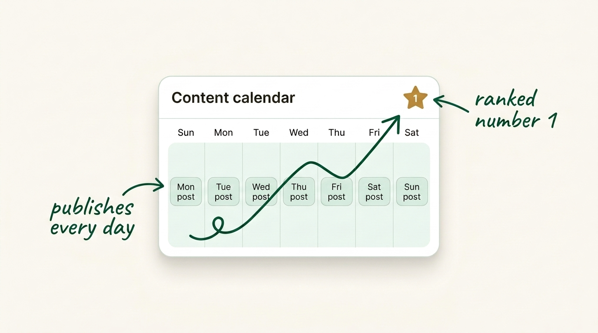

<div align="center">



# RankFirst skills

**Open [Claude Code](https://claude.com/claude-code) skills for building SaaS products — from the team behind [RankFirst](https://rankfirst.blog).**

[](https://claude.com/claude-code)
[](#skills-in-this-marketplace)
[](LICENSE)
[](https://rankfirst.blog)

</div>

---

We build [**RankFirst**](https://rankfirst.blog) — blog-on-autopilot that publishes SEO/GEO-optimized
articles every day so businesses rank on Google *and* get cited by AI search. Along the way we wrote a
lot of internal tooling for shipping a SaaS fast, and we're opening up the reusable pieces as **Claude
Code skills**. Add this marketplace once, install any skill below with a single command.

```bash
# In Claude Code:
/plugin marketplace add Rank-First/skills
/plugin install gemini-visuals@rankfirst
```

Prefer to copy the folder yourself? See **[Manual install](#manual-install-no-marketplace)** below.

> 💡 The banner above and the RankFirst logo were both produced with the `gemini-visuals` skill in this
> repo — it's dogfooded on our own brand.

---

## Skills in this marketplace

### `gemini-visuals` — Gemini visual review for your UI
**Gemini visual review**: have Google Gemini look at your screens and marketing art, critique them, and
iterate — a tight, repeatable loop that both reviews and produces on-brand visuals.

> **screenshot → Gemini review → generate/edit → screenshot → review → …** until it looks great.

Point it at any SaaS landing page — your product, a section you're redesigning, a competitor you're
benchmarking — and it turns ugly raw screenshots into clean, doodle-annotated illustrations that look
designed, not generated. It **auto-adopts the host project's own branding**: dropped into a project, it
resolves that project's colors and fonts from its theme/tokens (Tailwind config, CSS variables, design
tokens, logo, `manifest.json`…) and only asks you if it can't find them. On-brand out of the box, in any
project — nothing to hand-edit.

It does three jobs:
- **Generate** flat, doodle-annotated product illustrations from a tight, reusable style prompt.
- **Stage a real screenshot** (your app, a blog, anything) as a clean illustration with hand-drawn
  arrows/labels — instead of shipping a raw screenshot.
- **Competitor research** — Gemini reviews a shortlist of competitor sections and picks a design
  direction with a concrete spec, before you build.

The value isn't a magic prompt — it's the **loop + the hard-won gotchas** (label duplication,
table-column drift, `networkidle` hangs, ESM/NODE_PATH, handwriting drift across a set…). They're all
written up in the skill's
[`SKILL.md`](plugins/gemini-visuals/skills/gemini-visuals/SKILL.md).

---

## Install

### As a plugin (recommended — one command, gets updates)
```bash
/plugin marketplace add Rank-First/skills     # add this marketplace
/plugin install gemini-visuals@rankfirst      # install the skill
```
Then just ask Claude Code to "make a landing illustration for section X" — it reads `SKILL.md` and runs
the loop. Update later with `/plugin marketplace update rankfirst`.

### Manual install (no marketplace)
Copy the skill folder into your skills dir — project-level (`.claude/skills/`) or personal
(`~/.claude/skills/`); Claude Code auto-discovers both:
```bash
git clone https://github.com/Rank-First/skills
cp -r skills/plugins/gemini-visuals/skills/gemini-visuals ~/.claude/skills/gemini-visuals
```

### Use the scripts standalone (no Claude Code at all)
They're plain Node + Playwright:
```bash
cd skills/plugins/gemini-visuals/skills/gemini-visuals
bash scripts/setup.sh                              # makes Playwright resolvable
export GEMINI_API_KEY="<a BILLING-ENABLED key>"    # image gen has zero free-tier quota
cd scripts
node gemini-image.mjs out.png "<STYLE BLOCK from ../reference/style-prompt.md> <your subject>" --ar 4:3
node gemini-review.mjs "check spelling of every word; is it on-style?" out.png
```
The [`style-prompt.md`](plugins/gemini-visuals/skills/gemini-visuals/reference/style-prompt.md) holds
the STYLE BLOCK template + the brand-discovery procedure. Run as a skill it resolves your project's
palette/fonts automatically; standalone, fill the six `{{tokens}}` once (it falls back to a neutral
cream/charcoal default if you don't).

---

## Repo layout
```
skills/                                        ← this marketplace repo (Rank-First/skills)
├── .claude-plugin/marketplace.json            ← the catalog
├── assets/                                     ← README banner + logo (made with gemini-visuals)
├── plugins/
│   └── gemini-visuals/
│       ├── .claude-plugin/plugin.json         ← plugin manifest
│       └── skills/gemini-visuals/             ← the skill itself
│           ├── SKILL.md                       ← the workflow, recipes, gotchas
│           ├── reference/style-prompt.md      ← STYLE BLOCK template + brand discovery
│           └── scripts/                       ← 8 Node scripts + setup.sh
│               ├── gemini-image.mjs   generate OR edit an image (condition on --in refs)
│               ├── gemini-review.mjs  ask Gemini to critique image(s), prints text
│               ├── shot.mjs           screenshot a page (viewport / --sel / --full)
│               ├── section-shot.mjs   screenshot ONE section element, zoom-safe
│               ├── app-shot.mjs       log into an app, open a route, screenshot it
│               ├── clip-shot.mjs      clip from top of one section to bottom of another
│               ├── cap.mjs            robust full-page tiled capture (heavy sites)
│               ├── crop.mjs           crop a PNG to the top N px (strip navbars)
│               └── setup.sh           symlink/install Playwright next to the scripts
└── README.md
```

## Notes
- **Works with any front-end stack** — Next.js, Vite, Astro, plain HTML. Output is a normal PNG; ship
  it wherever your static assets live.
- **Billing-enabled Gemini key required** for image generation — the free tier is `limit: 0` on image
  models and returns `429 RESOURCE_EXHAUSTED`. Text review works on the free tier.
- **No secrets are stored anywhere** — everything reads from `GEMINI_API_KEY` / `APP_EMAIL` /
  `APP_PASSWORD` in your env. Nothing is hard-coded.
- Default image model is `gemini-3.1-flash-image-preview`; override with `GEMINI_IMAGE_MODEL`.

---

## About RankFirst

[**RankFirst**](https://rankfirst.blog) is blog-on-autopilot for growing businesses. Point it at your
site — it learns your brand voice, plans a month of SEO- and GEO-optimized posts, and publishes them
every day, so you show up in Google *and* in answers from ChatGPT, Claude, and Perplexity. You stay in
control: edit, regenerate, or unpublish anything. → **[rankfirst.blog](https://rankfirst.blog)**

Contributions and feedback welcome — the gotchas list grows every time someone hits a new one.

<sub>MIT licensed · Made by the RankFirst team · <a href="https://rankfirst.blog">rankfirst.blog</a></sub>
